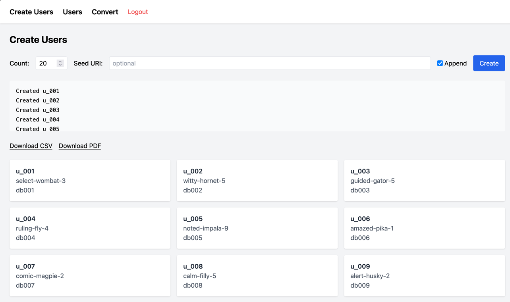
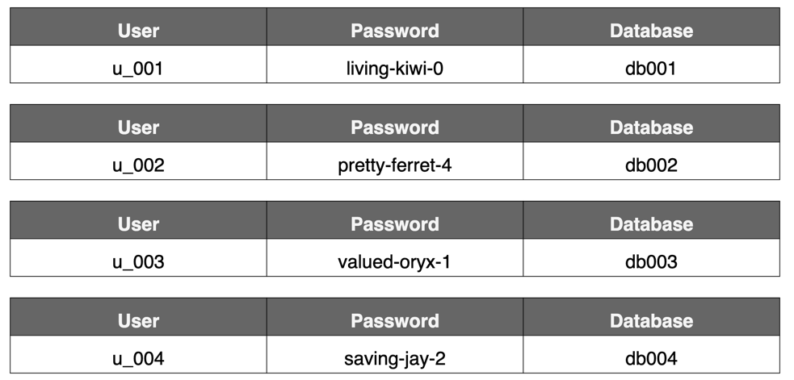

= GKE Neo4j Workshop Infrastructure

:toc:
:toc-placement!:

Welcome to a Neo4j Workshop environment creator.

toc::[]

== Purpose
Provision a Neo4j Enterprise cluster in GKE with TLS, DNS, and plugin support using Terraform. All created resources are labeled (where supported) with the configured `creator_name` or, where GCP does not support labels, the name of the resource will include the `creator_name` and `workshop_name`.

Terraform is used to manage the resources, making sure everything is deleted at the end.

== What It Provides

* GKE cluster with configurable node pool
* Neo4j Enterprise deployed through our official helm charts and with the below certs in place
* cert-manager setup with Let's Encrypt DNS challenge
* TLS certificate via Let's Encrypt, Cloud DNS and static IP
* APOC core plugin
* Optional GDS and Bloom plugin support via secret-based licensing
* A simple admin UI to manage users and databases

== Necessary Tools

* `gcloud`: CLI to manage Google Cloud resources. -> https://cloud.google.com/sdk/docs/install[Install]
* `kubectl`: CLI for Kubernetes cluster operations. -> https://kubernetes.io/docs/tasks/tools/install-kubectl-macos/[Install]
* `terraform`: Infrastructure-as-Code tool to manage deployments. Manages state (locally) and helps in deleting all resources after use. -> https://developer.hashicorp.com/terraform/tutorials/aws-get-started/install-cli[Install]

Authenticate with gloud:
[code,bash]
------
gcloud auth login
------

Aliases used in examples:
[code,bash]
------
alias k=kubectl
alias tf=terraform
------

== DNS

I registered the domain `neowork.me` and placed it into our gcloud control, so that the IPs can be updated. Your workshop domain would be a subdomain of this. Like `graphday-basf.neowork.me`. You can also use your own root domain. See below for the variables. The domain must be controlled by Google Cloud DNS.

DNS certificate creation and usage inside the cluster as well as assigning the static IP to the neo4j load balancer is all automated.

[NOTE]
====
*Let's Encrypt Rate Limits*
Let's Encrypt enforces a limit of #five# certificates per domain per week. Avoid reapplying too frequently to prevent issuance lockouts. Use a variant of the desired domain for testing.
====

== Required Variables
These must be placed into a file named `terraform.auto.tfvars` in the root directory. This file is not checked into git as it will be specific to each workshop. See `variables.tf` in the root folder for available variables and their description. Variable values given in `terraform.auto.tfvars` will overite the defaults in `variables.tf`

Choose a suitable `machine_type` with enough memory and cpu to support the expected attendees. See `variables.tf` for some examples and derived values.

.Sample `terraform.auto.tfvars`
[source,hcl]
-------------

project_id       = "..."
creator_name     = "..."
workshop_name    = "..."
email            = "..."
neo4j_domain     = "basf-madrid.neowork.me"
dns_root_domain  = "neowork.me"
worker_nodes     = ...
neo4j_core_count = ...
machine_type     = ".."
-------------

The current setup expects at least 3 neo4j pods as the cluster will not form otherwise.

== Licenses
Bloom and GDS need license files. These files will be stored a kubernetes secret. Place the files in:
[source]
--------
project-root/
├── licenses/
│   ├── bloom.license
│   └── gds.license
├── modules/
├── terraform.auto.tfvars
├── variables.tf
├── terraform.tf
└── ...
--------

If not provided, the plugins will not be deployed.

== How to Run It
Run the following commands from the root folder:

[source,bash]
--------
tf apply -target=module.gke
tf apply
--------
`tf apply` will always list the required changes first and ask for confirmation before applying.

The first will set up the GKE foundation and will run for about 10 minutes. The second command creates and deploys the SSL certificates and the neo4j cluster.

The terraform script will adjust the context of the local kubectl so that it points to the newly created cluster.

== How to Scale

Adjust the following in `terraform.auto.tfvars`:

* `worker_nodes`: total number of GKE worker nodes
* `neo4j_core_count`: number of Neo4j core pods

and run
[source,bash]
--------
tf apply
--------
The GKE node pool will be adjusted and new neo4j pods created. This will not destroy or restart existing nodes or pods (unless you lower the numbers).
New core pods will be automatically enabled and joined to the cluster.

== Cleanup
Once the workshop is concluded and the infrastructure is not needed anymore, it can be deleted with

[source,bash]
--------
tf destroy
--------

== Pitfalls and Diagnosis

* **TLS not ready**: check cert-manager logs (`k logs -n cert-manager <pod>`) and certificate status
* **Bolt not accepting connections**: provisioning waits for TCP readiness, but actual Bolt availability may lag
* **Let's Encrypt errors**: rate-limited or misconfigured domain DNS
* **Dangling pods**: `k delete pod -n neo4j <name>` if Terraform no longer manages them
* **Docker builds on Mac**: use `--platform linux/amd64` to avoid format errors

== UI and API for user and database creation
A REST API module will provide endpoints to:

* Create N Neo4j databases and associated users
* Optionally seed databases from a public GCS bucket
* Support CSV or JSON responses
* drop all users, roles and databases
* Provide a web UI for basic interaction
* Generate a PDF with user login credentials for handouts
* it will be automatically deployed and the URL will be displayed at the end of the deployment

Below image shows a portion of the user creation in the UI:

And this is what the downloadable PDF looks like:

=== Users and databases

The UI allows to mass-create users, roles and databases with optional seeding the DBs from a public url.

Each user gets her own database and is assigned a role that grants `archtitect` roles for only that database.
No other databases are accessible for the user.

Each database is created with `CREATE DATABASE {db} IF NOT EXISTS TOPOLOGY 1 PRIMARY`. So not clustered to preserve resources.

Name patters:

* databases: `dbxxx`
* roles: `r_xxx`
* users: `u_xxx`

The API will not touch any databases, roles or users that do not match that pattern.

[code,cypher]
----
include::modules/api/app/main.py[tag=user-creation]
----

The API image is built separately and tagged by version. This repository always references the latest version.

== Testing

There is simple testing script in the `loadtest` directory. See the readme there for usage.

_this repo might contain traces of LLM generated content_
